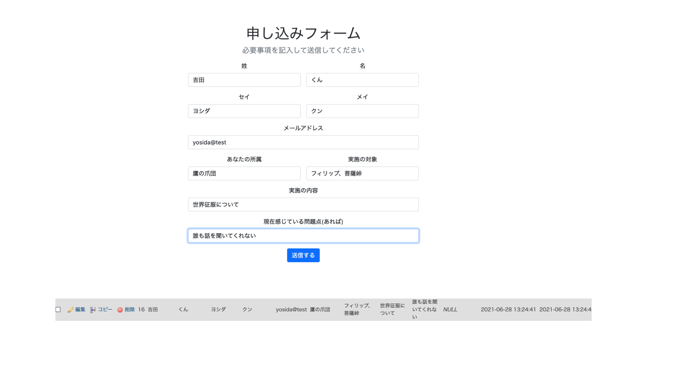
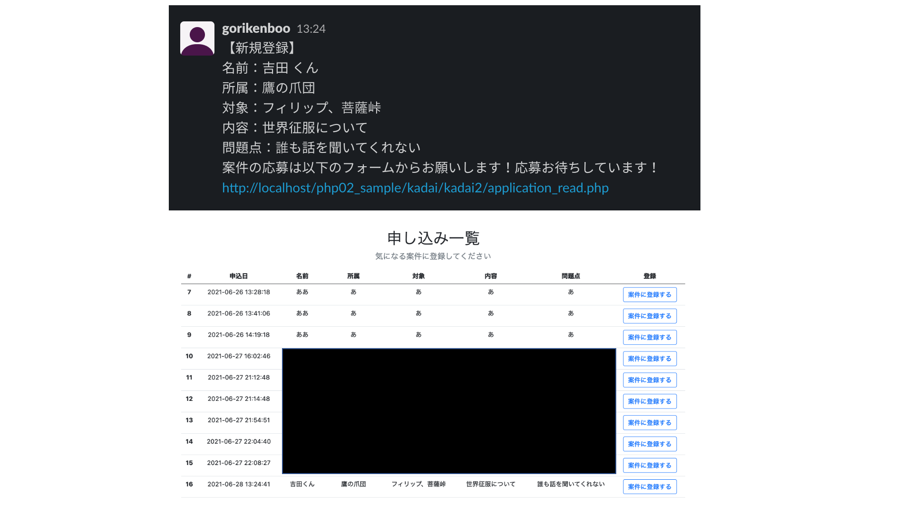
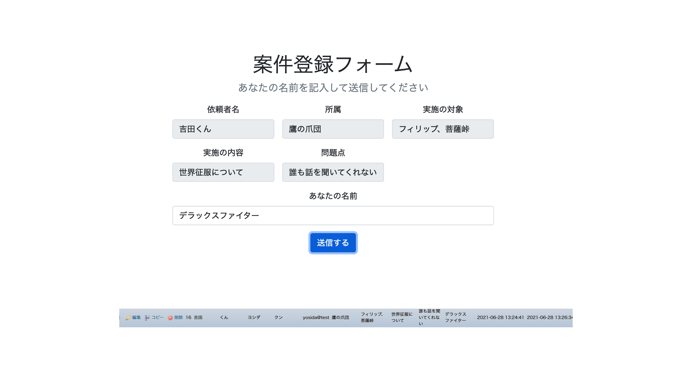

# 登録フォーム改造版
## プロダクト紹介
- 前回の登録フォームをより現実的なものに改造しました
- 相談者が登録したところまでが前回の内容でしたが、今回は登録した時にスラックに情報が投稿されるようにしました
- 登録した情報一覧を見れるURLをつけていて、そこから案件に登録できるようになっています
- 案件に登録することでDBをアプロードしてNULLにしていたところに登録した人の名前が入るという感じです
- application_inputが依頼者の登録フォームで、その情報をapplication_createでDBに記録&slackへ投稿&「登録ありがとうございます」メッセージの表示
- application_readが案件一覧表示&案件登録フォームへのリンク生成
- application_updateが案件登録&登録完了メッセージ表示
- slack_postでslackのapiを記述、application_createでincludeして使っている
- slack_postにapi keyを入力する必要があるが、そもそも投稿されるslackに入っていないのであまり意味はないかもしれない

## 工夫した点、こだわった点
- phpでAPIを実装した(2回目)
- 今回もbootstrap使ってみた(bootstrapしか勝たん)
- できればCSSは一行も書きたくないスタイルw
- SlackのAPIを実装するのに少し苦労した
- 実際に大学院で教育工学を学ぶ人たちのSlackの運営を自分でしているので、ちゃんとデプロイすればサービスとしてできそうなのを作った
- JSでうまくいかない時は、phpでサーバーサイドでやらせれば今のところうまくいくのがここまでの気づき
- Slackに投稿するのも関数にしておいたのでスッキリ
- 案件登録で依頼者の名前とかはreadonlyでこちら側でいじれないようにした
## 苦戦した点、共有したいハマりポイントなど
- 最初はnode.js使わないとSlackのAPIが動かなくて、詰んでたが、phpでやればうまくいった
- phpはコード書くファイルが多くなってしまい、どこに何を書けばいいのか混乱してしまう
- 案件の登録が済んだやつを違うところに表示することがまだできてないので修正点
## 感想
- 今回は納得いくのができた！
- 今週は出張でコード書けなそうなので、早めに仕上げて提出！
- FBIと今回で2回もphpに救われてる気がするから、少し好きになってきた
- 急造したので、セキュリティガバガバなのでそこらへんをちょいちょい修正していきたい